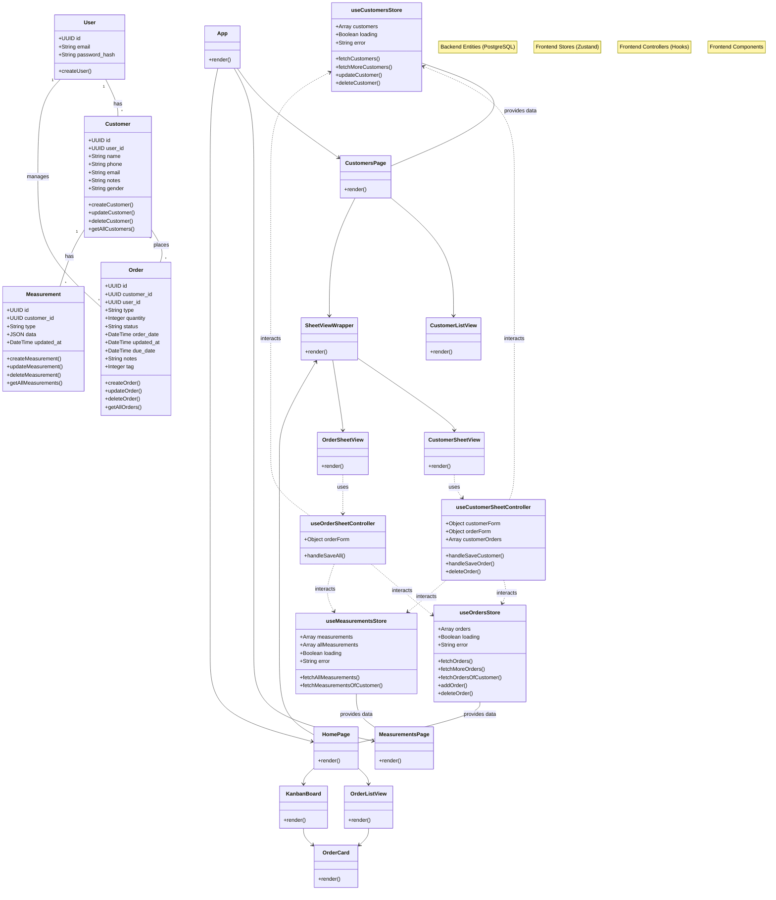

# Tailor Track (React)

Tailor Track is a web application for managing tailoring orders, customers, and measurements. It is built using the MERN stack (PostgreSQL, Express, React, Node.js).

## Project Structure

- **Backend**: Node.js/Express server with PostgreSQL database.
- **Frontend**: React application using Vite, Tailwind CSS, and Zustand for state management.

## Class Diagram

The following diagram illustrates the key entities in the backend, the state management stores in the frontend, and the main React components.

